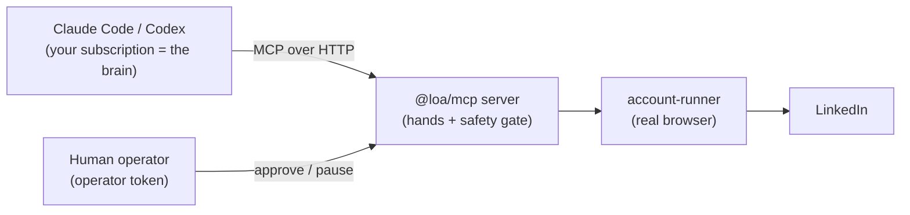

# Driving the agent (bring your own brain)

The framework is an MCP server. It is the hands plus a server-side safety gate,
not the brain. The intelligence that decides who to reach out to and what to say
can come from two places.

## Two topologies

### Driven mode (primary)

An external agent connects to the MCP server as the client. Claude Code or Codex,
running on the operator's own model subscription, is the brain. It calls the
Observe tools, reasons and writes the copy itself, then calls the gated Act
tools. Nothing on the framework side needs an LLM key, and there is no per-token
cost on the framework side.

The driving agent connects with the non-privileged agent context and gets
Observe, Act, and Campaign tools. A human operator connects with the privileged
context and gets the Approval and Safety families. Both talk to the same server,
so the same autonomy gate governs both.

### Autonomous mode (fallback)

When no external agent is attached, the framework runs its own internal loop and
calls an LLM through a key. The provider is optional and selected server-side by
which key is present: `OPENROUTER_API_KEY` uses OpenRouter (any model in
`vendor/model` form via `OPENROUTER_MODEL`), else `ANTHROPIC_API_KEY` uses
Claude, else the runtime falls back to a deterministic fake. Use this only when
you do not want to keep a driving session attached.

Both modes are safe the same way: the autonomy and approval gate is enforced
server-side regardless of which brain drives. Under the `supervised` autonomy
level every send and reply queues to human approval. See the autonomy matrix in
`control-plane/mcp/src/gate.ts`.

## Capability tokens

Caller identity is set by a bearer token, checked in
`control-plane/mcp/src/server.ts`. Privilege derives from which token you send,
never from a header the caller can set freely.

| `Authorization` header | Token env var | Result |
|--------|-------|--------|
| `Bearer <LOA_MCP_TOKEN>` | `LOA_MCP_TOKEN` | Driving-agent context: Observe + Act + Campaign |
| `Bearer <LOA_OPERATOR_TOKEN>` | `LOA_OPERATOR_TOKEN` | Operator context: Approval + Safety, plus everything the agent can call |

A missing or unrecognized bearer is rejected with `401` before any tool runs.
Set `x-loa-operator` to your operator name if you want it recorded on audit
entries; it is a label only and grants nothing.

In production (`NODE_ENV=production`) the endpoint fails closed: with
`LOA_MCP_TOKEN` unset, `POST /mcp` returns `503`. In local development with no
token set, all callers are allowed as a labeled operator and the server logs a
one-time warning, so you can run without secrets on your own machine.

A common setup is two MCP client connections to the same URL: one with the agent
token for the driver, one with the operator token for approvals. The MCP
endpoint is `POST /mcp`; health is `GET /healthz` on `MCP_PORT` (default 8080)
and stays open for platform health checks.

## Which tools each role uses

Agent (driver, non-privileged):

- Observe: `get_profile`, `get_recent_posts`, `get_post_engagers`,
  `get_company_jobs`, `get_conversation`, `search_people`, `source_people`.
- Act (routed through the gate): `send_connection`, `send_message`,
  `view_profile`, `follow`, `withdraw_invite`, `react_to_post`.
- Campaign and state: `create_campaign`, `add_targets`,
  `attach_external_context`, `get_account_state`, `get_queue`, `get_metrics`,
  `define_sequence`, `get_sequence`, `enroll_targets`.
- Lead lists (results show up in the web UI): `create_list`, `list_lists`,
  `get_list`, `source_to_list`.

Operator (privileged):

- Approval: `list_pending`, `approve`, `edit_and_approve`, `reject`,
  `set_autonomy_level`.
- Safety and admin: `pause_account`, `resume_account`, `kill_all`, `get_health`,
  `rotate_session`, `audit_log`.

## The driver playbook

Each cycle the driving agent runs this loop, once per account, bounded by
budget. This is the same loop the example driver in `examples/driver/` encodes.

1. Read the budget and state. Call `get_account_state` for the account. If the
   account is `Restricted`, `Cooldown`, or `Throttled`, or the daily budget is
   spent, stop this cycle for that account.
2. Read the queue. Call `get_queue` for the account to see what is already
   pending, so you do not re-enqueue the same target.
3. For each target within budget:
   - `get_profile` and `get_recent_posts` to gather signal.
   - Optional enrichment: run the agent's own web search or research, then feed
     the result in with `attach_external_context` (see below). The framework
     does not discover or enrich prospects itself.
   - Draft the copy with the agent's own model. Keep the connection note under
     300 characters (the `send_connection` note limit).
   - Call `send_connection` (with an optional `note`) or `send_message` (with a
     `body`). Under `supervised` autonomy these enqueue rather than send. The
     tool result tells you the outcome: `executed`, `queued` (with a
     `pendingId`), `deferred`, or `denied`.
4. Approvals (operator role, may be the same human in a second connection).
   Call `list_pending` to see queued sends, then `approve`, `edit_and_approve`
   (to rewrite the body first), or `reject` each one. Approved items dispatch;
   rejected items never send.
5. Read `get_metrics` for the campaign to see the funnel, and stop when the
   budget for the cycle is spent.

The gate, not the agent, decides whether a send goes out. The agent should never
try to exceed budget or route around a `deferred` or `denied` result. If a call
comes back `denied` for a safety reason, surface it to the human rather than
retrying.

## Enrichment without breaking the scope wall

Prospect discovery and enrichment are deliberately out of scope for the
framework: it consumes targets, it never detects them. But a driving Claude Code
or Codex agent can do its own research (web search, a company site, a CRM) and
attach the result to a target with `attach_external_context(targetId, context)`.
The `context` is an arbitrary blob the agent controls. This is the intended way
to run "search and enrichment" tasks: the reasoning and web access live in the
driving agent, and only the finished context crosses into the framework.

## No LLM key in driven mode

In driven mode the drafting happens in your agent's model, so the framework
needs no `ANTHROPIC_API_KEY` or OpenRouter key. The internal LLM provider is only
used in autonomous mode. You still need the runtime secrets that are not about
the brain: `DATABASE_URL`, `COOKIE_VAULT_KEY`, and the `PROXY_*` values for a
real account.

## Related docs

- `docs/SCHEDULING.md`: running driven mode on a recurring schedule.
- `docs/P0-RUNBOOK.md`: first-run, one-account setup end to end.
- `examples/driver/`: a copy-paste driver prompt for Claude Code or Codex.
- `infra/RAILWAY.md`, `infra/PROXY.md`: deployment and proxy leak guard.
